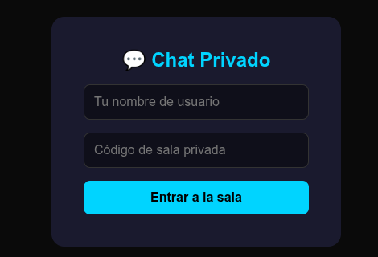
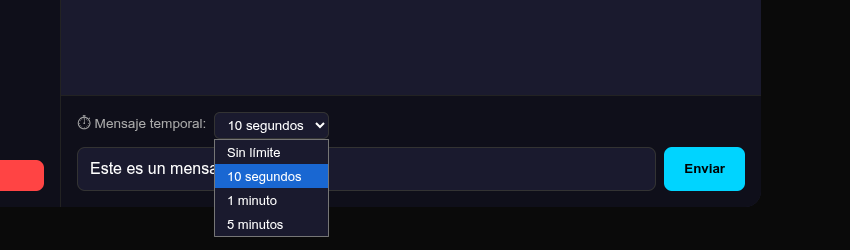
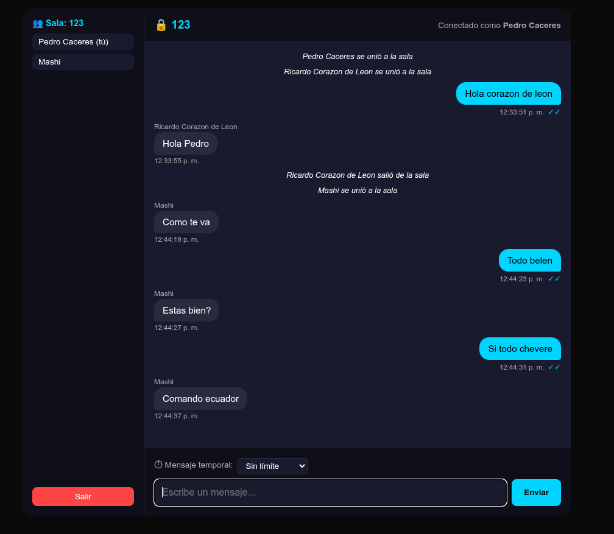

# 💬 Mensajería Privada en Tiempo Real (Tipo Signal)

> **Institución:** Universidad de las Fuerzas Armadas ESPE
> **Carrera:** Ingeniería de Software
> **Asignatura:** Aplicaciones Distribuidas
> **Laboratorio:** #2 - Privacidad Avanzada con WebSockets
> **Profesor:** Geovanny Cudco
> **Estudiante:** Wilmer Buestan
> **Fecha:** Mayo 2026

---

## 🚀 1. Descripción del Proyecto
Desarrollo de un sistema de mensajería privada en tiempo real con características de privacidad avanzada, incluyendo mensajes temporales y confirmación de lectura. El sistema utiliza una arquitectura cliente-servidor mediante WebSockets y el protocolo de eventos de SocketIO.

### ✨ Funcionalidades Obligatorias Implementadas:
* **[✓] Confirmación de Lectura (Read Receipts):** Indicador visual de doble check al visualizar el mensaje.
* **[✓] Mensajes Temporales (TTL):** Selección de tiempo de vida (10s, 1m, 5m) con eliminación automática.
* **[✓] Privacidad Digital:** No se persiste historial en servidor; gestión segura de sesiones.
* **[✓] Gestión de Salas:** Comunicación restringida por códigos de sala privada.

---

## 🛠️ 2. Guía de Instalación y Ejecución

### 🖥️ Paso 1: Clonar el Repositorio
```bash
git clone https://github.com/WilmerBuestan/MensajeriaPrivadaDistribuido.git
cd MensajeriaPrivadaDistribuido
```

### 🐍 Paso 2: Configuración del Backend (Flask)
1. Crear y activar el entorno virtual:
   ```bash
   python3 -m venv venv
   source venv/bin/activate
   ```
2. Instalar dependencias:
   ```bash
   pip install flask flask-socketio flask-cors eventlet
   ```
3. Iniciar el servidor:
   ```bash
   python server.py
   ```

### ⚛️ Paso 3: Configuración del Frontend (React)
1. Instalar módulos de Node (asegúrate de estar en la carpeta del frontend):
   ```bash
   npm install
   ```
2. Ejecutar la aplicación:
   ```bash
   npm run dev
   ```

---

## 🧪 3. Demostración Visual (Capturas)

* **Ingreso Privado:**


* **Mensajes Temporales:**


* **Confirmación de Lectura:**


---

## 🧠 4. Explicación Técnica

### 📬 Confirmación de Lectura
Implementada con **Intersection Observer** en React. Al visualizar el mensaje, se emite `message_read`. El servidor retransmite esta confirmación únicamente al emisor original para actualizar el estado del "check".

### ⏳ Mensajes Temporales
* **Cliente:** Inicia una cuenta regresiva local (hook de estado).
* **Servidor:** Utiliza `threading.Timer` para invalidar el mensaje tras el TTL configurado, asegurando la privacidad de la comunicación.

---

## 🔗 Repositorio
[https://github.com/WilmerBuestan/MensajeriaPrivadaDistribuido](https://github.com/WilmerBuestan/MensajeriaPrivadaDistribuido)